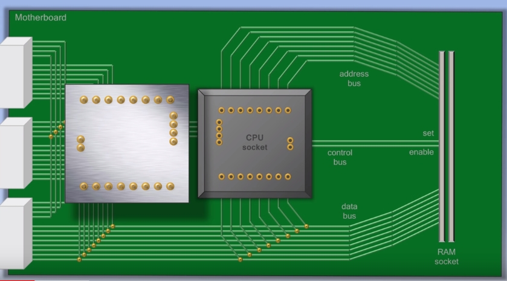
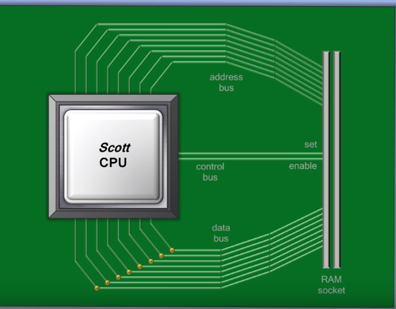
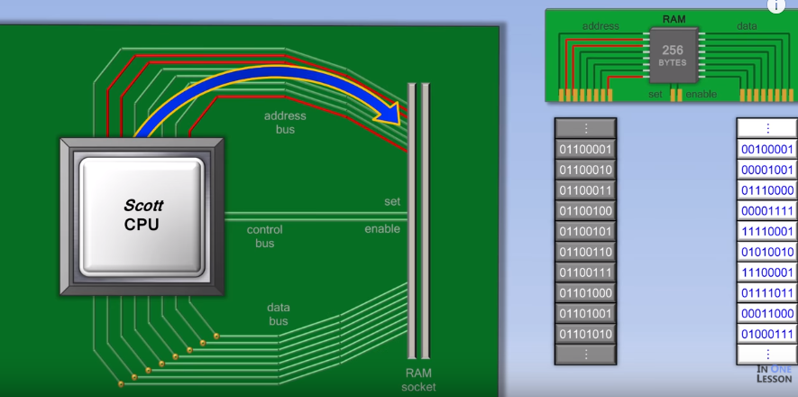
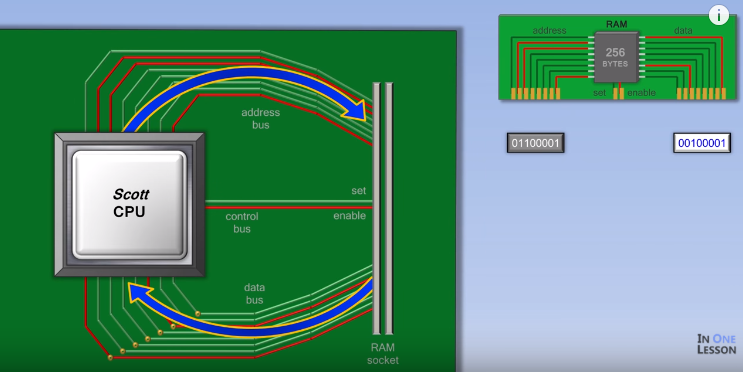
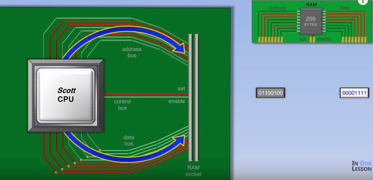
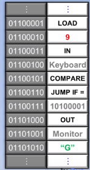
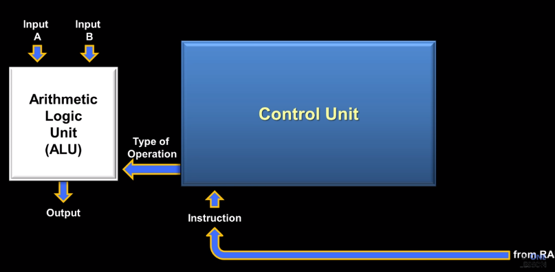
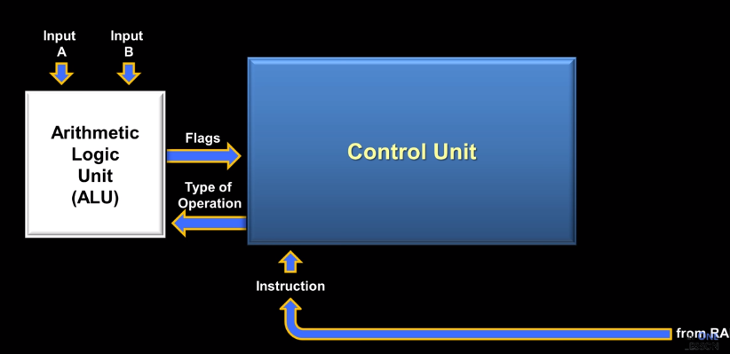

CPU如何工作

> 进入计算机内部以发现CPU的内部工作情况，包括控制单元、ALU、寄存器等。

CPU是`Central Processing Unit`的缩写，CPU相当于是计算机的大脑，当你理解了CPU，你离理解计算机也就不远了。CPU内部有很多线路，每个CPU中有一个特别的线路按照稳定的速率切换开关，这是为了保证各个线路的同步工作，这条线路被称为时钟。就比如下面这个虚拟机大约1秒两个周期。

现代CPU以GHz来计量，G代表giga——10亿，Hz代表每秒动作次数。现代CPU每秒切换几十亿次，这就是为什么CPU能够快速的处理非常复杂的计算，实际上CPU每个周期干的事情非常简单，我们将在下面的内容中逐一介绍。

### 硬件层面

你的电脑CPU可能是有一些公司比如说Intel、AMD等制造的，不过这篇文章我们讲述的是一个虚拟的CPU，`Scott CPU`，这来自一本书——`But How Do It Know?The Black Principles of Computers for Everyone`，作者是 john Scott。

当你翻到CPU的背面，你可以看到这里有一些引脚，这些引脚可以让CPU接受和发送消息。

CPU将被插入到主板（`mother board`）上，主板让计算机中的各个组件可以相互连接。

### RAM

主板的右边部分是用来插RAM（`random access memory`）的，也就是内存条，里面存储着将被CPU处理的数据。

#### CPU和RAM的合作

现在我们只看主板的右半部分。

RAM通过地址一个接一个的访问数据，因此被称为随机访问存储器。

当CPU执行程序的时候会通过发送一个地址到RAM来执行。当然有了地址也不行，必须接收到CPU发送来的`set`或者`enable`信号RAM才会真正的工作。如果**enable**线通电（有效）那RAM就会将相应地址的数据通过数据总线返回到CPU。

CPU接受数据进行处理后，就继续发送下一个地址，然后取回数据进行处理，这个过程将不断重复。当CPU需要将数据保存时，就需要给出保存的地址、保存的数据，并且将**set**线通电（置为有效）

RAM中的数据包含`指令`、`数据`，数据包含`数字`、`地址`、`字符`。

### 指令集

RAM中有一些空间是用来保存指令的。对于这些指令种类的结合我们称之为指令集，不同的CPU一般会有不同的指令集，指令集指导CPU电路如何设计实现，反过来说CPU物理上也决定了自己的指令集。

一般来说大部分CPU都会有类似这几个功能的指令

- LOAD ——将数据从RAM加载到CPU
- ADD——实现两个数的求和
- STORE——将CPU中的数据保存到RAM
- COMPARE——比较两个数的大小用于布尔条件判断
- JUMP IF Condition——如果满足条件则跳转到RAM中某个位置
- OUT——输出数据到一个外设，比如说显示器
- IN——从一个外设中读取数据，比如说键盘

这些指令是大部分CPU指令集中都会有的，其他的指令可能因不同实用功能的CPU而不同。

RAM中就是一系列指令的序列，比如下面这张图，

CPU会不停地从RAM中读取这些指令进行处理，直到程序结束。

### CPU内部

CPU内部又分为一些个组件，其中比较重要的就是`控制单元（Control Unit）`和`算术逻辑单元（Arithmetic Logic Unit）`。

CU就像军队的指挥官，用于接受RAM中的指令，并将这个指令分解为更细小的需要其他CPU中组件执行的特定命令。

ALU在CU的控制下处理实际的算术逻辑计算，比如加法、减法、比较等。

ALU有两个输入A和B，假设A和B是来自LOAD指令，现在CU接受到一条指令用于计算A和B的和。

首先，CU接受到RAM中的指令，通过指令的编码知道这是一条什么样的指令（Type of Operation），将操作类型告诉ALU，ALU就会根据这个操作类型进行操作，并且输出这个操作结果。有时候ALU并没有输出，比如像比较操作，这时候一般是需要一系列标志位来表示处理状态，帮助CU执行接下来的动作，比如说跳转等，就像下图

### 参考资料

#### 参考作品

- In One Lesson.(2013).[CPU如何工作](https://www.youtube.com/watch?v=cNN_tTXABUA&t=30s&list=LL2JoHmVrJ6bx5dH_yFKKGQg&index=4)

#### 参考文献

#### 参考书目
