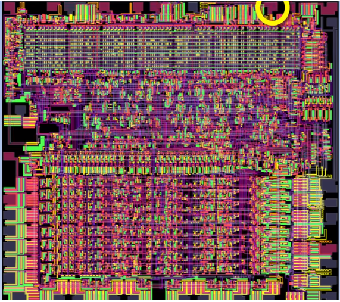
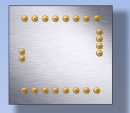

## CPU如何工作

> 进入计算机内部以发现CPU的内部工作情况，包括控制单元、ALU、寄存器等。

CPU是`Central Processing Unit`的缩写，CPU相当于是计算机的大脑，当你理解了CPU，你离理解计算机也就不远了。CPU内部有很多线路，每个CPU中有一个特别的线路按照稳定的速率切换开关，这是为了保证各个线路的同步工作，这条线路被称为时钟。就比如下面这个虚拟机大约1秒两个周期。

现代CPU以GHz来计量，G代表giga——10亿，Hz代表每秒动作次数。现代CPU每秒切换几十亿次，这就是为什么CPU能够快速的处理非常复杂的计算，实际上CPU每个周期干的事情非常简单，我们将在下面的内容中逐一介绍。

### 硬件层面

你的电脑CPU可能是有一些公司比如说Intel、AMD等制造的，不过这篇文章我们讲述的是一个虚拟的CPU，`Scott CPU`，这来自一本书——`But How Do It Know?The Black Principles of Computers for Everyone`，作者是 john Scott。

当你翻到CPU的背面，你可以看到这里有一些引脚，这些引脚可以让CPU接受和发送消息。

CPU将被插入到主板（`mother board`）上，主板让计算机中的各个组件可以相互连接。

### RAM

主板的右边部分是用来插RAM（`random access memory`）的，也就是内存条，里面存储着将被CPU处理的数据。

#### CPU和RAM的合作

现在我们只看主板的右半部分。

RAM通过地址来访问数据

### 参考资料

#### 参考作品

- In One Lesson.(2013).[CPU如何工作](https://www.youtube.com/watch?v=cNN_tTXABUA&t=30s&list=LL2JoHmVrJ6bx5dH_yFKKGQg&index=4)

#### 参考文献

#### 参考书目
